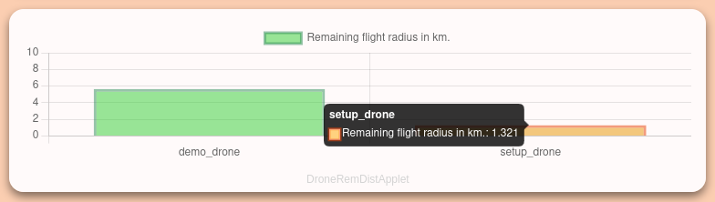

# ADDS ControlPanel

## Visualize blackbox data and more from your ADDS drone fleet

ADDS-ControlPanel can visualize your drone's data like GPS-location,
takeoff / landing location, altitude, velocity, battery state of charge and
much more. Show live-data or check flight parameters of previous flights with
an interactive OSM map and simple data charts.

**Note:** ADDS-FlightControl is needed as the data management system.

## Setup

Clone the repository:

```bash
git clone https://github.com/Andreas-Menzel/ADDS-ControlPanel.git
```

Update the URL to your Flight Control instance by changing the
`flightControlUrl` constant in `/app/js/main.js`:

```javascript
const flightControlUrl = 'http://adds-demo.an-men.de/';
```

Open the website (/app/index.html). Currently no server-side features are
implemented, so an installation on a web-server on not necessary.

## Applets

The application consists of multiple applets. Each applet can visualize a
specific dataset. Adding or removing drones from the list in the main script
results in all applets automatically updating.

### MapApplet

Shows an interactive map using OpenStreetMaps to visualize the position of each
drone, takeoff and landing site. The map automatically adjusts the center and
zoom-level to the position of all drones currently active, so everything of
interest is visible all the time.


### DroneAltitudeApplet

Shows the altitude of each drone using a bar graph. Simple, but effective.


### DroneVelocityApplet

Shows the velocity of each drone using a bar graph. Switching between the
NED (North-East-Down) and NWU (North-West-Up) system is possible. You can also
change the unit from m/s to km/h.


### DroneSoCApplet

Shows the batteries state of charge of each drone using bar graphs. The bars
become orange on < 40% soc and red on < 20% soc.


### DroneRemDistApplet

Shows the remaining flight radius of each drone using bar graphs. The bars
become orange on < 2km range and red on < 1 km range.


