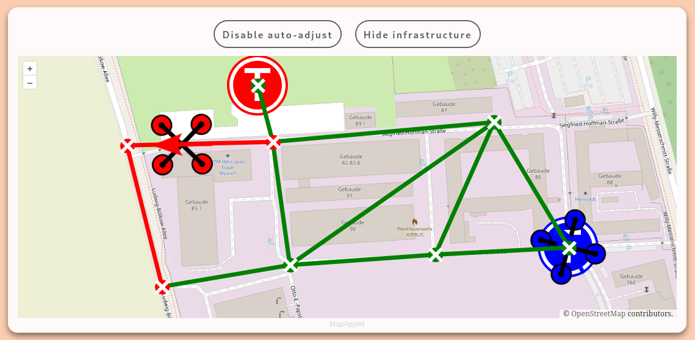
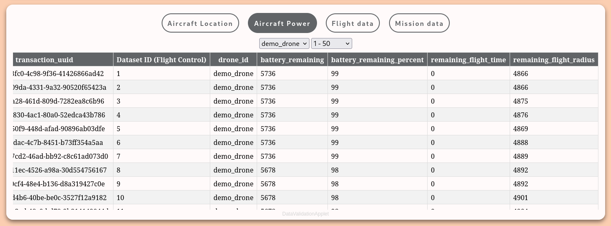

# ADDS-ControlPanel

## Comprehensive Visualization of Your ADDS Drone Fleet Data

ADDS-ControlPanel offers a holistic view of your drone's key performance metrics
such as GPS-location, takeoff/landing locations, altitude, velocity, battery
state of charge, and much more. Whether you want to monitor live-data or
analyze flight parameters from previous flights, ADDS-ControlPanel provides an
intuitive interface with an interactive OSM map and clear data charts.

**Note:** [ADDS-FlightControl](https://github.com/Andreas-Menzel/ADDS-FlightControl)
is a prerequisite as it acts as the data management system.

## Quick Setup

1. **Clone the repository:**

```bash
git clone https://github.com/Andreas-Menzel/ADDS-ControlPanel.git
```

2. **Update Flight Control Instance URL:** Modify the `flightControlUrl` constant
in `/app/js/main.js` to match your Flight Contron instance.

```javascript
const flightControlUrl = 'http://adds-demo.an-men.de/';
```

3. **Access the Website:** Navigate to `/app/index.html`. No server-side
features are currently implemented, so there's no need for installation on a web
server.

## Applets

The application comprises multiple applets, each designed to visualize specific
datasets. Adding or removing drones automatically updates all applets.

### MapApplet

Presents an interactive map using OpenStreetMaps to display each drone's
position, as well as takeoff and landing sites. The map automatically adjusts
the center and zoom-level according to the positions of all active drones,
ensuring you never miss any important detail.



### DataValidationApplet

This applet provides an organized and straightforward way to review all data
sent from each drone. Displayed in easy-to-read tables, you can inspect critical
flight details like GPS coordinates, altitude, velocity, and more. The ability
to quickly overview and analyze these data contributes to effective fleet
management and enhances decision-making processes.





### InfrastructureManagementApplet

This applet allows for the efficient management of your drone infrastructure. It
lets you add, remove, or modify the intersections and corridors that are stored
in and managed by the [Flight Control](https://github.com/Andreas-Menzel/ADDS-FlightControl)
system.


### DroneAltitudeApplet

Displays each drone's altitude using a simple yet effective bar graph.


### DroneVelocityApplet

Illustrates the velocity of each drone using a bar graph. It allows for
switching between the NED (North-East-Down) and NWU (North-West-Up) system. You
can also toggle the unit from m/s to km/h.


### DroneSoCApplet

Visualizes the battery state of charge for each drone using bar graphs. The bars
change color to orange when the charge is below 40% and red when it's below 20%.


### DroneRemDistApplet

Shows the remaining flight radius of each drone using bar graphs. The bars turn
orange when the range is less than 2km and red when it's less than 1 km.


